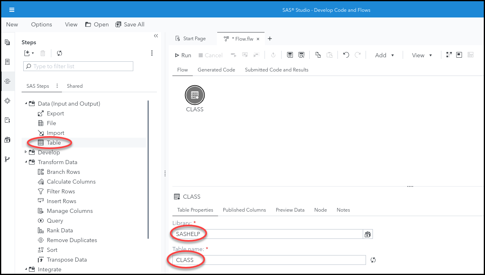
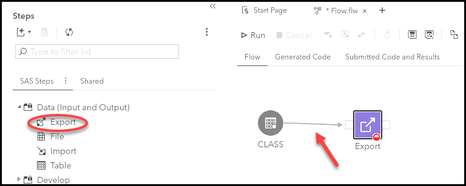
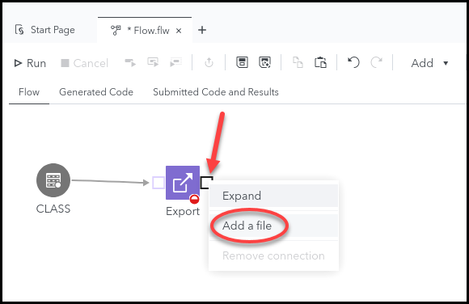
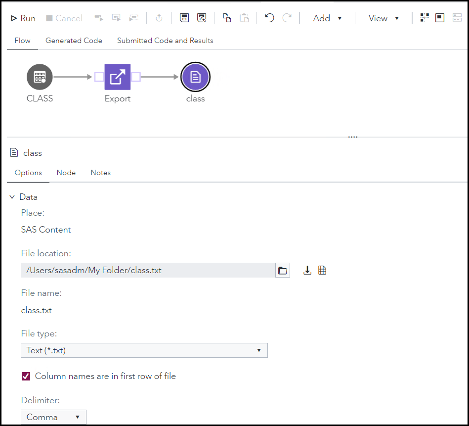
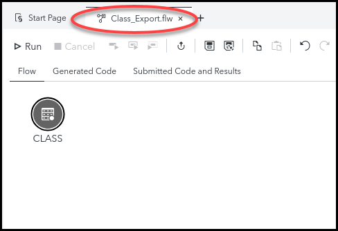
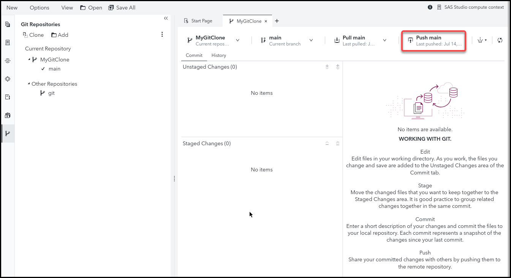
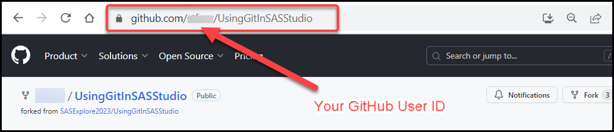
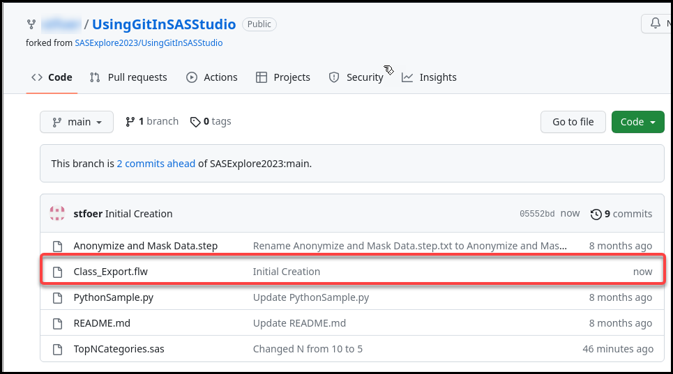

# SAS Studio Flows - Push a New Flow to Git

 

## Exercise Description

In this exercise you will use SAS Studio to create a simple SAS Studio Flow and push it to GitHub.

 

- [SAS Studio Flows - Push a New Flow to Git](#sas-studio-flows---push-a-new-flow-to-git)
  - [Exercise Description](#exercise-description)
  - [Exercise Preparation](#exercise-preparation)
  - [Create a SAS Studio flow that writes a file from a dataset](#create-a-sas-studio-flow-that-writes-a-file-from-a-dataset)
  - [Push the Flow File to your GitHub Repository](#push-the-flow-file-to-your-github-repository)
  - [End](#end)
  - [Navigation](#navigation)

## Exercise Preparation

1. Open the **Google Chrome** browser on your Windows RACE Image.
1. Select the **SAS Viya** bookmark.
1. Enter the following:
   - User ID: **sasadm**
   - Password: **lnxsas**

    

1. Click **Sign In**.
 

## Create a SAS Studio flow that writes a file from a dataset

1. Select  **&#10132; Develop Code and Flows** to open *SAS Studio*.

1. Select **New &#10132; Flow**.

1. Select  to view the **Steps** pane.
   

1. Double-click the **Table** step in the *Data (Input and Output)* section of the *Steps* pane to add it to the flow canvas.

1. In the **Table Properties** section select the following:
   - Library:  **SASHELP**
   - Table name: **CLASS**

   

1. Double click or drag the **Export** step onto the flow canvas and connect it to the **CLASS** table as shown below.
    

1. Right click the **Export** node's output port and select **Add File**.
    

1. Click on the output file icon and select its location and file name.  Navigate to **SAS Content ➔ Users ➔ sasadm ➔ My Folder** and name the file **class.txt**.
    

1. Select  to save the flow.

1. Navigate to Folder **Shortcuts ➔ Shortcut to MyGitClone**.

1. Enter **CLASS_Export** for the name and click <mark>**SAVE**</mark>.
    

 
 

## Push the Flow File to your GitHub Repository

1. Select  to view the **Git Repositories** in SAS Studio.

1. Double Click **MyGitClone**.

1. Click the **Class_Export.ftw** flow beneath the **Unstaged Changes (1)** heading.

2. Select  to stage the flow.
    

1. Note that the flow is now staged for commit.

1. Add the comment, **Initial Creation** and click **<mark>Commit</mark>**.
    

1. Click the **Push main** button to push the committed flow to the repository.
    

1. In *Google Chrome*, navigate to your Github repository to see that the change is reflected there.  You stored the GitHub link in Visual Studio code in exercise 1.  It should look like this:  **https://github.com/<<(Your Github ID)>>/UsingGitInSASStudio**.
    

1. You should now see the flow added to your GitHub Repository.
    

 
 

## End

## Navigation

<!-- startnav -->

<!-- endnav -->
