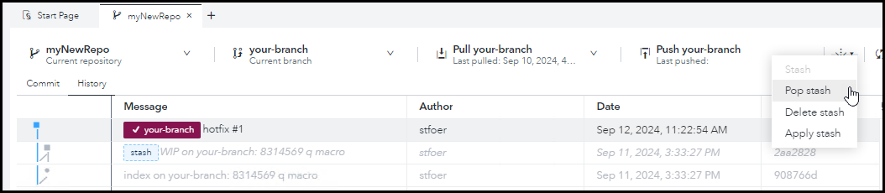

# SAS Studio - Working with Git Branches

<br>

## Exercise Description

In this exercise, you will work with Git branches in SAS Studio.

<br>

* [Exercise Description](#exercise-description)
* [Exercise Preparation](#exercise-preparation)
* [1. Create a Branch](#1-create-a-branch)
* [2. Merge a Branch into Main](#2-merge-a-branch-into-main)
* [3. Resolve a Merge Conflict](#3-resolve-a-merge-conflict)
   * [Create Branches](#create-branches)
   * [Changes on *your-branch*](#changes-on-your-branch)
   * [Changes on *his-branch*](#changes-on-his-branch)
   * [Merge Conflict](#merge-conflict)
   * [Resolve the Conflict](#resolve-the-conflict)
* [4. Reset a Branch](#4-reset-a-branch)
   * [Branch *your-branch*](#branch-your-branch)
   * [Branch  *his-branch*](#branch-his-branch)
* [5. Rebase a Branch with Another](#5-rebase-a-branch-with-another)
   * [Branch  *his-branch*](#branch-his-branch-1)
   * [Branch  *your-branch*](#branch-your-branch-1)
   * [Rebase](#rebase)
* [6. Stash your Work in Progress](#6-stash-your-work-in-progress)
* [7. Push the Branches](#7-push-the-branches)
* [End](#end)
* [Navigation](#navigation)

## Exercise Preparation

1. Open the **Google Chrome** browser on your Windows RACE Image.
1. Select the **SAS Viya** bookmark.
1. Enter the following:
   - User ID: **sasadm**
   - Password: **lnxsas**

1. Click **Sign In**.
    

1. Select  **&#10132; Develop Code and Flows** to open *SAS Studio*.

## 1. Create a Branch

1. Select  to view the **GIT** tab in *SAS Studio*.

2. *Double click* the **myGitFolder** icon.

3. Select the **History** tab.

4. *Right click* on the most recent commit row and select **Create new branch**.
   >Note:  You can create a branch on any commit.  All of the changes after the commit will be ignored.

5. Name your branch **feature/T-545-report-change**.
   >Note: This is typical branch naming convention. **feature** denotes the type of branch.  Others are **bug-fix**, **release**, **hot-fix**, etc.  **T-545** denotes a task ID from **Jira**. The suffix is a description of the feature.

6. Leave the checkboxes as they are and click **Create**.
   

   

<br>

## 2. Merge a Branch into Main

1. Select  to view the **Explorer** tab in *SAS Studio*.

2. *Double click* the **TopNCategories.sas** file in **MyGitClone** to open it.
3. In the program editor, change the **category** macro variable from **Origin** to **Type** in both the **%let** statement as well as the report title.
4. Save the file.

   

5. Select  to view the **GIT** tab in *SAS Studio*.
6. Select the **feature/T-545-report-change** branch.
7. As you did in the earlier exercises, stage and commit the changes with the comment **`Report Change`**.
8. Select the **History** tab and note that the feature branch is ahead of the main branch with the changes you made.

   

9. Switch to the main branch.
10. *Right Click* on the feature branch commit that is ahead of the main branch and select **Merge into main** and select the feature branch.
   
11. Note that the main and feature branch are both on the same commit now.

<br>

## 3. Resolve a Merge Conflict

### Create Branches

1. Select  to view the **Git** tab in *SAS Studio*.

2. Select the **History** tab.
3. With your **main** branch selected, create a branch named **your-branch**.
   1. *Right click* the latest commit and select **Create New Branch**.
   2. Name the branch, **your-branch**.
   3. *Un-check* **Checkout after create** and click **Create**.
4. With your **main** branch selected, create another branch named **his-branch**.
   1. *Right click* the latest commit again and select **Create New Branch**.
   2. Name this branch, **his-branch**.
   3. *Un-check* **Checkout after create** and click **Create**.
5. You should now have 4 branches, **main**, **his-branch**, **your-branch**, and your feature branch from earlier.
   

### Changes on *your-branch*

6. Check out **your-branch** by choosing it from the **Current branch** drop down menu.

   

1. Open the **TopNCategories.sas file** from *Shortcut to MyGitClone* and make the following changes:

1. Change the value of N from **5** to **15** in the `%let N=5` line:

   

1. Save and close the program.

1. Move back to the Git  screen.

1. Stage and commit the changes to **your-branch** with the message **your-branch commit**.

   

### Changes on *his-branch*

12. Check out **his-branch** by choosing it form the **Current branch** drop down menu.

1. Re-open the **TopNCategories.sas** program.

   > Note that the changes you made are gone.  They were committed to **your-branch** so the working directory returned to its original state.

1. Make changes to the program.

1. Change the value of **N** to **11**. **`%let n=5;`** to **`%let n=11;`**.

   

1. Save and close the program.

1. Return to the Git  screen.

1. Stage and commit the changes with the comment, **his-branch commit**.

### Merge Conflict

19. Check out **your-branch** by choosing it from the **Current branch** drop down menu.
1. Open the **History** tab, *right click* **his-branch commit** and select **Merge into your-branch > his-branch**.
    

1. You will receive an error that there was a conflict.

   

### Resolve the Conflict

22. Close the error.

1. Select the **Commit** tab and note that the program has an icon with two opposing arrows.  If you hover over the icon, it says **File has Conflict**.
1. *Right click* the file and select **Edit**.
   

1. Note that the file includes both **your-branch** and **his-branch** changes.
1. If there is a conflict, you'll see both branches' content identified by branch. The conflict comes from the fact that, on the same line (20), *n* has different values on the two branches.
   

1. Remove the **`<<<<`**, **`>>>>`**  and **`====`** lines.
1. Leave the **%let n=11;** line.

   

1. Save and close the file.
1. Stage and Commit with the comment, **Conflict Resolved**.
1. Check the History tab to see the merge visual is complete.
   

<br>

## 4. Reset a Branch

### Branch *your-branch*

1. Be sure to do the previous steps so that your repository is in a modified state, and have a known state (commit), you can reset to.

1. Open the Git  and select the **History** tab.
1. Check out **your-branch** by selecting it from the **Current branch** drop down menu.
1. *Right click* the **feature/T-545-report-change main** `Report change` commit and select **Reset**.
   - > This action takes **your-branch** back to its state at that particular commit.

   

1. You'll see dialog box asking which reset type you would like to perform:
   - >**Soft** = Only reset the repository.  Leave the changes in the staging area and the working directory.
   - >**Mixed** = Reset the repository and the staging area.  Leave the changes in the working directory.
   - >**Hard** = Reset the repository, the staging area, and the working directory.  Completely erase the changes.

1. Select a **Hard** reset and push **OK**.

   

1. After the reset, you'll see **your-branch** has been returned to the commit you selected.

   

   - > Note that **his-branch** has not been affected by the reset.

1. With **your-branch** checked out, confirm that the changes to your working directory files have been erased by the reset. In `TopNCategories.sas` you should see `%let n=5;`.

### Branch  *his-branch*

9. Check out **his-branch** and reset it to the same commit as well.

<br>

## 5. Rebase a Branch with Another

### Branch  *his-branch*

1. Check out **his-branch** and add the following code to **TopNCategories.sas** after the **footnote** statement:

```sas
/* his-branch: add merror option */
options merror;
```

   

2. Save and close the **TopNCategories.sas** file.
3. Return to the Git  page, stage and commit the change with the message, **merror**.

### Branch  *your-branch*

4. Check out **your-branch** and add the following code to **TopNCategories.sas** in the **%let** statement block:

```sas
/* your-branch: Added q macro variable */
%let q=16;
```

   

5. Save the file, stage and commit the change with the comment: **q macro**.

### Rebase

6. Select the **History** tab.
7. Right click the latest commit, **his-branch merror** and select **Rebase your-branch on > Selected Commit**

   
8. You will see the following text box:

   

9.  Select **OK**.
10. On the **History** tab, note that:

   - >**your-branch** now includes the **his-branch merror** commit.
   - >The commit illustration shows no merge.  It's as if **your-branch** was created from **his-branch**.
   

11. Open the **TopNCategories.sas** file and see that it includes the modification from **his-branch**.
    

<br>

## 6. Stash your Work in Progress

1. Use **Git Stash** to save your work temporarily while you quickly complete a hotfix for a different project.

2. Make the following changes to **your-branch**:
   1. Copy the **TopNCategories.sas** program by right clicking it and selecting **Copy to** and selecting the **myGitClone** folder.
   2. This will create a file named **TopNCategories_Copy1.sas**.
   3. Right click that file and rename it **NewCategoriesReport.sas**.
   4. Rename **TopNCategories.sas** to **OldCategoriesReport.sas**.
   5. Rename **PythonSample.py** to **PythonProgram.py**.
   6. Add a note to the **Class_Export.flw** flow by opening it, right clicking the canvas and selecting **Add a Note**: `This flow writes the CLASS table to a text file`.

      

1. Save and close the flow.
1. Return to the Git screen and **stage** your changes.  **Do not commit them.**
   

1. Stash your changes by pushing the stash icon  and selecting **Stash**.
1. After the stash, note that the staged changes have disappeared.  The changes are now stored in the stash.
1. Return to the Explorer  and look at the contents of your Git working directory.  It has reverted back to its state prior to your stashed changes.

   

1. Complete the work for your hotfix by editing the **PythonSample.py** and adding the code **import swat** as shown below.
   
1. Save and close the file.
1. On the git screen , **stage** and **commit** the change with the comment **hotfix #1**.
1. Open the history tab and note that **your-branch** is now one commit ahead of the stash.

   

1. Push the stash icon  and select **Pop stash**.
   - > **Pop stash** applies the stashed changes and deletes the stash.
   - > **Apply stash** applies the stashed changes but keeps the stash.

   

1. After **Pop stash**, note that the stashed changes are re-introduced, and that the hotfix change is also maintained and applied to the renamed file.

   

<br>

## 7. Push the Branches

Push the branches remotely:

* **your-branch**:
   * Stage the changes.
   * Commit with the message **hotfix #2**.
   * Push it remotely.

* Swap to **his-branch**:
   * Push it remotely.

* Swap to **feature/T-545-report-change**:
   * Push it remotely.

## End

## Navigation

<!-- startnav -->
* [01 Introduction / 01 010 Reserve Hardware](/01_Introduction/01_010_Reserve_Hardware.md)
* [01 Introduction / 01 020 Post Deployment Tasks](/01_Introduction/01_020_Post_Deployment_Tasks.md)
* [02 SAS Studio Git / 02 012 SAS Studio GIT Integration HTTPS Setup](/02_SAS_Studio_Git/02_012_SAS_Studio_GIT_Integration_HTTPS_Setup.md)
* [02 SAS Studio Git / 02 032 SAS Studio SAS Program](/02_SAS_Studio_Git/02_032_SAS_Studio_SAS_Program.md)
* [02 SAS Studio Git / 02 042 SAS Studio Flows](/02_SAS_Studio_Git/02_042_SAS_Studio_Flows.md)
* [02 SAS Studio Git / 02 052 SAS Studio GIT Branches](/02_SAS_Studio_Git/02_052_SAS_Studio_GIT_Branches.md)**<-- you are here**
<!-- endnav -->
