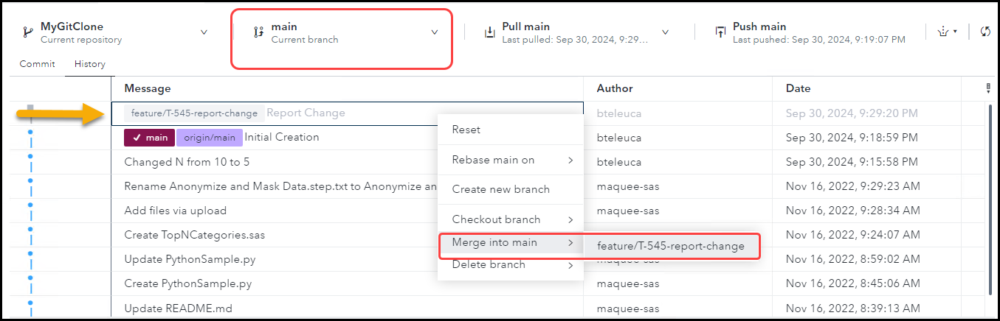
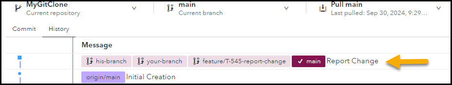
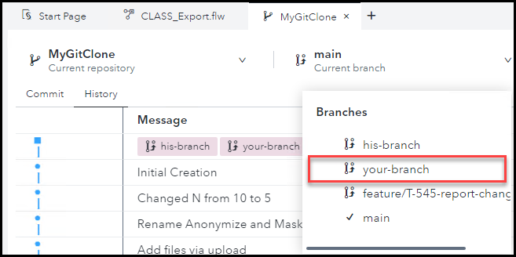
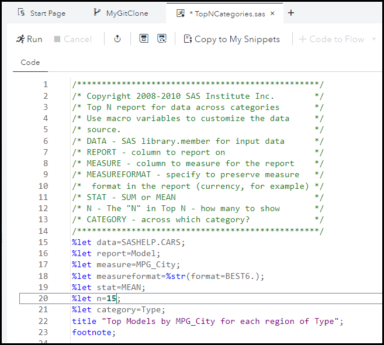
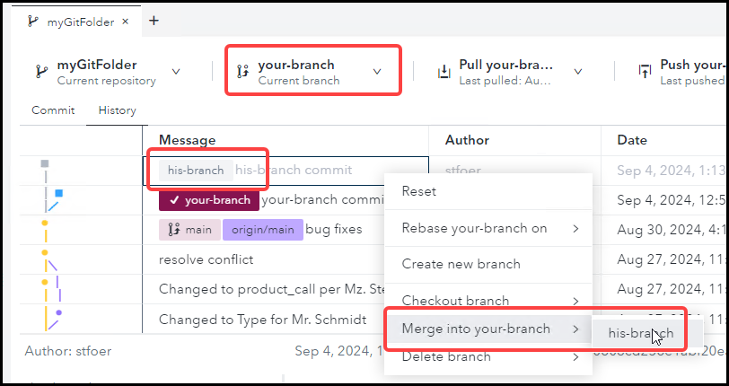
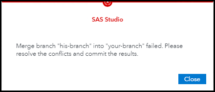
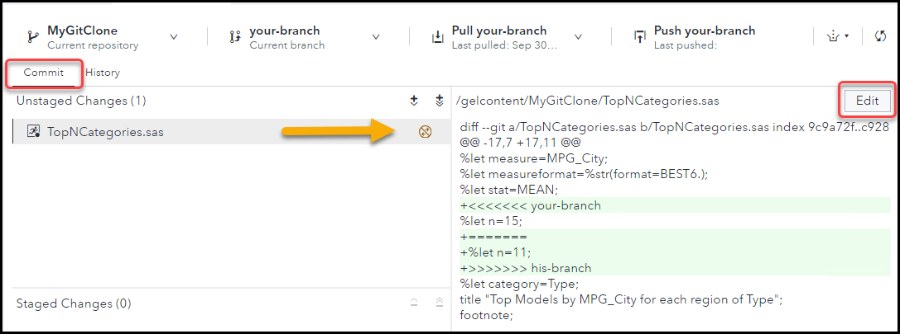
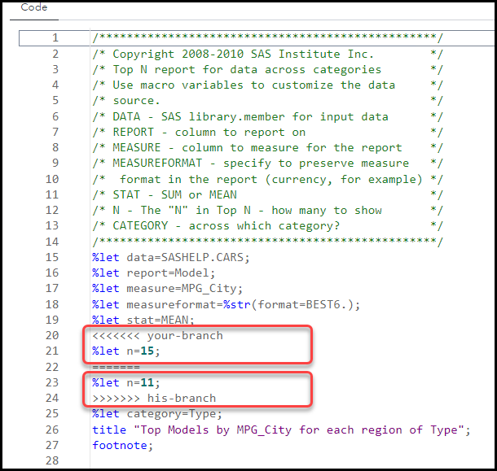
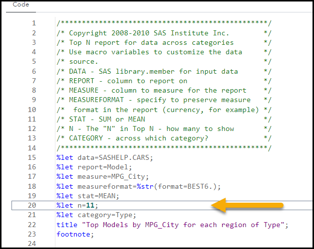

# SAS Studio - Working with Git Branches

 

## Exercise Description

In this exercise, you will work with Git branches in SAS Studio.

 

- [SAS Studio - Working with Git Branches](#sas-studio---working-with-git-branches)
  - [Exercise Description](#exercise-description)
  - [Exercise Preparation](#exercise-preparation)
  - [1. Create a Branch](#1-create-a-branch)
  - [2. Merge a Branch into Main](#2-merge-a-branch-into-main)
  - [3. Resolve a Merge Conflict](#3-resolve-a-merge-conflict)
    - [Create Two Different Branches](#create-two-different-branches)
    - [Changes on *your-branch*](#changes-on-your-branch)
    - [Changes on *his-branch*](#changes-on-his-branch)
    - [Merge Conflict](#merge-conflict)
    - [Resolve the Conflict](#resolve-the-conflict)
  - [End](#end)
  - [Navigation](#navigation)

## Exercise Preparation

1. Open the **Google Chrome** browser on your Windows RACE Image.
1. Select the **SAS Viya** bookmark.
1. Enter the following:
   - User ID: **Alex**
   - Password: **lnxsas**

1. Click **Sign In**.

1. Select  **&#10132; Develop Code and Flows** to open *SAS Studio*.

## 1. Create a Branch

1. Select  to view the **GIT** tab in *SAS Studio*.

2. *Double click* the **myGitFolder** icon.

3. Select the **History** tab.

4. *Right click* on the most recent commit row and select **Create new branch**.
   >Note:  You can create a branch on any commit.  All of the changes after the commit will be ignored.

5. Name your branch **feature/T-545-report-change**.
   >Note: This is typical branch naming convention. **feature** denotes the type of branch.  Others are **bug-fix**, **release**, **hot-fix**, etc.  **T-545** denotes a task ID from **Jira**. The suffix is a description of the feature.

6. Leave the checkboxes as they are and click **Create**.
   

   

 

## 2. Merge a Branch into Main

1. Select  to view the **Explorer** tab in *SAS Studio*.

2. *Double click* the **TopNCategories.sas** file in **MyGitClone** to open it.
3. In the program editor, make the following changes:
   - Change the **category** macro variable from **Origin** to **`Type`** in the **%let** statement.
   - Change the report title to **`Top Models by MPG_City by Vehicle Types`**.

4. Save the file.

 
5. Select  to view the **GIT** tab in *SAS Studio*.
6. Select the **feature/T-545-report-change** branch.
7. As you did in the earlier exercises, stage and commit the changes with the comment **`Report Change`**.
8. Select the **History** tab and note that the feature branch is ahead of the main branch with the changes you made.

   

9.  Switch to the main branch.
10. *Right Click* on the feature branch commit that is ahead of the main branch and select **Merge into main** and select the feature branch.
   
11. Note that the main and feature branch are both on the same commit now.

 

## 3. Resolve a Merge Conflict

### Create Two Different Branches

1. Select  to view the **Git** tab in *SAS Studio*.

2. Select the **History** tab.
3. With your **main** branch selected, create a branch named **your-branch**.
   1. *Right click* the latest commit and select **Create New Branch**.
   2. Name the branch, **your-branch**.
   3. *Un-check* **Checkout after create** and click **Create**.
4. With your **main** branch selected, create another branch named **his-branch**.
   1. *Right click* the latest commit again and select **Create New Branch**.
   2. Name this branch, **his-branch**.
   3. *Un-check* **Checkout after create** and click **Create**.
5. You should now have 4 branches, **main**, **his-branch**, **your-branch**, and your feature branch from earlier.
   

### Changes on *your-branch*

1. Check out **your-branch** by choosing it from the **Current branch** drop down menu.

   

1. Open the **TopNCategories.sas file** from *Shortcut to MyGitClone* and make the following changes:

1. Change the value of N from **5** to **15** in the `%let N=5` line:

   

1. Save and close the program.

1. Move back to the Git  screen.

1. Stage and commit the changes to **your-branch** with the message **your-branch commit**.

   

### Changes on *his-branch*

1. Check out **his-branch** by choosing it form the **Current branch** drop down menu.

1. Re-open the **TopNCategories.sas** program.

   > Note that the changes you made are gone.  They were committed to **your-branch** so the working directory returned to its original state.

1. Make changes to the program.

1. Change the value of **N** to **11**. **`%let n=5;`** to **`%let n=11;`**.

   

1. Save and close the program.

1. Return to the Git  screen.

1. Stage and commit the changes with the comment, **his-branch commit**.

### Merge Conflict

1. Check out **your-branch** by choosing it from the **Current branch** drop down menu.
1. Open the **History** tab, *right click* **his-branch commit** and select **Merge into your-branch > his-branch**.
    

1. You will receive an error that there was a conflict.

   

### Resolve the Conflict

1. Close the error.

1. Select the **Commit** tab and note that the program has an icon with two opposing arrows.  If you hover over the icon, it says **File has Conflict**.
1. *Right click* the file and select **Edit**.
   

1. Note that the file includes both **your-branch** and **his-branch** changes.
1. If there is a conflict, you'll see both branches' content identified by branch. The conflict comes from the fact that, on the same line (20), *n* has different values on the two branches.
   

1. Remove the **`<<<<`**, **`>>>>`**  and **`====`** lines.
1. Leave the **%let n=11;** line.

   

1. Save and close the file.
1. Stage and Commit with the comment, **Conflict Resolved**.
1. Check the History tab to see the merge visual is complete.
   

 

## End

## Navigation

<!-- startnav -->

<!-- endnav -->
