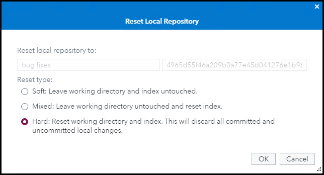
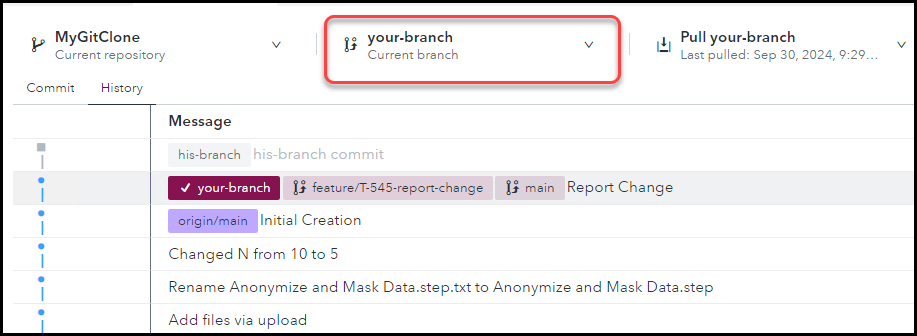
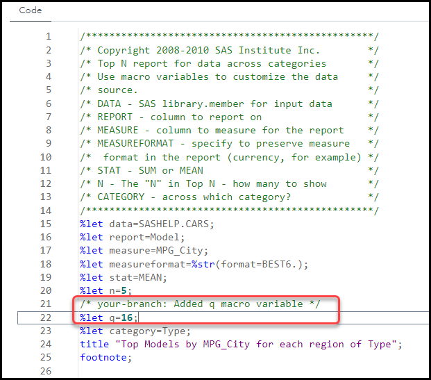
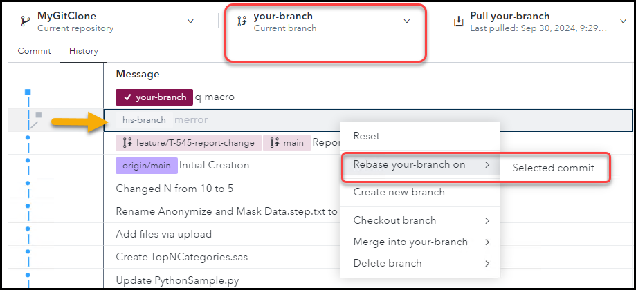
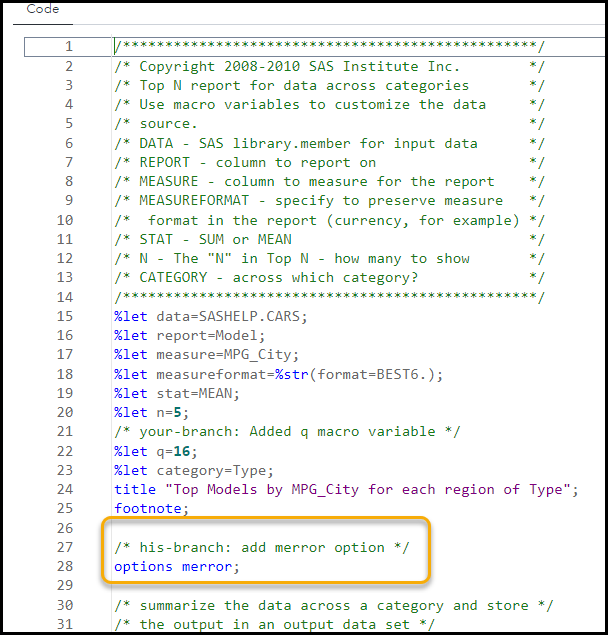
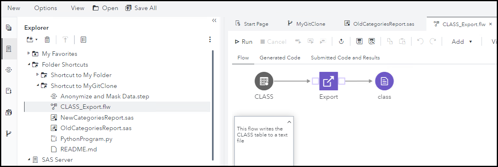
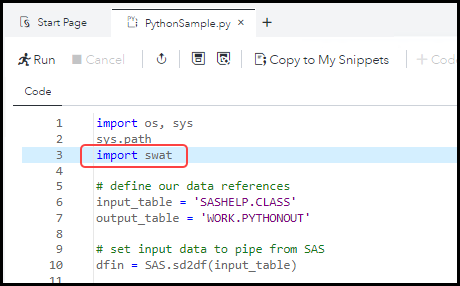

# SAS Studio - Working with Git Branches

<br>

## Exercise Description

In this exercise, you will work with Git branches in SAS Studio.

<br>

- [SAS Studio - Working with Git Branches](#sas-studio---working-with-git-branches)
  - [Exercise Description](#exercise-description)
  - [Exercise Preparation](#exercise-preparation)
  - [Reset a Branch](#reset-a-branch)
    - [Reset *your-branch*](#reset-your-branch)
    - [Reset *his-branch*](#reset-his-branch)
  - [Rebase a Branch with Another](#rebase-a-branch-with-another)
    - [Modify *his-branch*](#modify-his-branch)
    - [Modify *your-branch*](#modify-your-branch)
    - [Rebase *your-branch*](#rebase-your-branch)
  - [Stash your Work in Progress](#stash-your-work-in-progress)
  - [Navigation](#navigation)

## Exercise Preparation

1. Open the **Google Chrome** browser on your Windows RACE Image.
1. Select the **SAS Viya** bookmark.
1. Enter the following:
   - User ID: **Alex**
   - Password: **lnxsas**

1. Click **Sign In**.

1. Select  **&#10132; Develop Code and Flows** to open *SAS Studio*.
2. Complete the steps in the previous exercise.  This exercise builds on that one.


## Reset a Branch

### Reset *your-branch*

1. Be sure to do the previous steps so that your repository is in a modified state, and have a known state (commit), you can reset to.

1. Open the Git  and select the **History** tab.
1. Check out **your-branch** by selecting it from the **Current branch** drop down menu.
1. *Right click* the **feature/T-545-report-change main** `Report change` commit and select **Reset**.
   - > This action takes **your-branch** back to its state at that particular commit.

   

1. You'll see dialog box asking which reset type you would like to perform:
   - >**Soft** = Only reset the repository.  Leave the changes in the staging area and the working directory.
   - >**Mixed** = Reset the repository and the staging area.  Leave the changes in the working directory.
   - >**Hard** = Reset the repository, the staging area, and the working directory.  Completely erase the changes.

1. Select a **Hard** reset and push **OK**.

   

1. After the reset, you'll see **your-branch** has been returned to the commit you selected.

   

   - > Note that **his-branch** has not been affected by the reset.

1. With **your-branch** checked out, confirm that the changes to your working directory files have been erased by the reset. In `TopNCategories.sas` you should see `%let n=5;`.

### Reset *his-branch*

9. Check out **his-branch** and reset it to the same commit as well.

<br>

## Rebase a Branch with Another

### Modify *his-branch*

1. Check out **his-branch** and add the following code to **TopNCategories.sas** after the **footnote** statement:

```sas
/* his-branch: add merror option */
options merror;
```

   

2. Save and close the **TopNCategories.sas** file.
3. Return to the Git  page, stage and commit the change with the message, **merror**.

### Modify *your-branch*

4. Check out **your-branch** and add the following code to **TopNCategories.sas** in the **%let** statement block:

```sas
/* your-branch: Added q macro variable */
%let q=16;
```

   

5. Save the file, stage and commit the change with the comment: **q macro**.

### Rebase *your-branch*

6. Select the **History** tab.
7. Right click the latest commit, **his-branch merror** and select **Rebase your-branch on > Selected Commit**

   

8. You will see the following text box:

   

9.  Select **OK**.
10. On the **History** tab, note that:

   - >**your-branch** now includes the **his-branch merror** commit.
   - >The commit illustration shows no merge.  
  
   

11. Open the **TopNCategories.sas** file and see that it includes the modification from **his-branch**.

    

<br>

## Stash your Work in Progress

1. Use **Git Stash** to save your work temporarily while you quickly complete a hotfix for a different project.

2. Make the following changes to **your-branch**:
   1. Copy the **TopNCategories.sas** program by right clicking it and selecting **Copy to** and selecting the **myGitClone** folder.
   2. This will create a file named **TopNCategories_Copy1.sas**.
   3. Right click that file and rename it **NewCategoriesReport.sas**.
   4. Rename **TopNCategories.sas** to **OldCategoriesReport.sas**.
   5. Rename **PythonSample.py** to **PythonProgram.py**.
   6. Add a note to the **Class_Export.flw** flow by opening it, right clicking the canvas and selecting **Add a Note**: `This flow writes the CLASS table to a text file`.

      

1. Save and close the flow.
1. Return to the Git screen and **stage** your changes.  **Do not commit them.**
   

1. Stash your changes by pushing the stash icon  and selecting **Stash**.
1. After the stash, note that the staged changes have disappeared.  The changes are now stored in the stash.
1. Return to the Explorer  and look at the contents of your Git working directory.  
   
   >It has reverted back to its state prior to your stashed changes.

   

2. Complete the work for your hotfix by editing the **PythonSample.py** and adding the code **import swat** as shown below.

   

3. Save and close the file.
4. On the git screen , **stage** and **commit** the change with the comment **hotfix #1**.
5. Open the history tab and note that **your-branch** is now one commit ahead of the stash.

   

6. Push the stash icon  and select **Pop stash**.
   - > **Pop stash** applies the stashed changes and deletes the stash.
   - > **Apply stash** applies the stashed changes but keeps the stash.

   

7. After **Pop stash**, note that the stashed changes are re-introduced, and that the hotfix change is also maintained and applied to the renamed file.

   

<br>


## Navigation

<!-- startnav -->
* [01 SAS Studio-Git-Integration-Setup](/01_SAS-Studio-Git-Integration-Setup.md)
* [02 SAS Studio SAS Program](/02_SAS_Studio_SAS_Program.md)
* [03 SAS Studio GIT Branches 1](/03_SAS_Studio_GIT_Branches_1.md)
* [04 SAS Studio GIT Branches 2](/04_SAS_Studio_GIT_Branches_2.md)**<-- you are here**
<!-- endnav -->
