# SAS Studio - Git Integration Setup
- [SAS Studio - Git Integration Setup](#sas-studio---git-integration-setup)
  - [Exercise Description](#exercise-description)
  - [Create Personal Access Token for GitHub](#create-personal-access-token-for-github)
  - [Confirm your Email Settings for GitHub](#confirm-your-email-settings-for-github)
  - [Create a Fork of a GitHub Repository](#create-a-fork-of-a-github-repository)
  - [Create a Git Profile in SAS Studio](#create-a-git-profile-in-sas-studio)
  - [Create a Folder for the Local Copy of the Repository](#create-a-folder-for-the-local-copy-of-the-repository)
  - [Add Repository in SAS Studio](#add-repository-in-sas-studio)
  - [Review Git Repository](#review-git-repository)
  - [Exercise Navigation](#exercise-navigation)

 

## Exercise Description
In this exercise, you will setup the integration between a GitHub repository and SAS Studio.  The cloning of the repository in this exercise is done using HTTPS.  For an example using SSH, review <a href="https://communities.sas.com/t5/SAS-Communities-Library/How-to-Clone-a-GitHub-Repository-in-SAS-Studio-Using-SSH/ta-p/872728" target="_blank">this post</a>.

 
 

## Create Personal Access Token for GitHub
1. In *Google Chrome*, navigate to <a href="https://github.com/maquee-sas/SASStudioWorkshop" target="_blank">https://github.com/maquee-sas/SASStudioWorkshop</a>.
1. Click **Sign in** to sign in with your *GitHub* credentials.

     > &#9755; If you do not already have *GitHub* credentials, then click **Sign Up** and follow the instructions to create them.  Please do the sign-up portion on a browser on your actual PC rather than the course image.  You can return to the course image if you want after the sign-up process or continue to work in GitHub on your PC.

1. Select your account picture **&#10132; Settings**.

    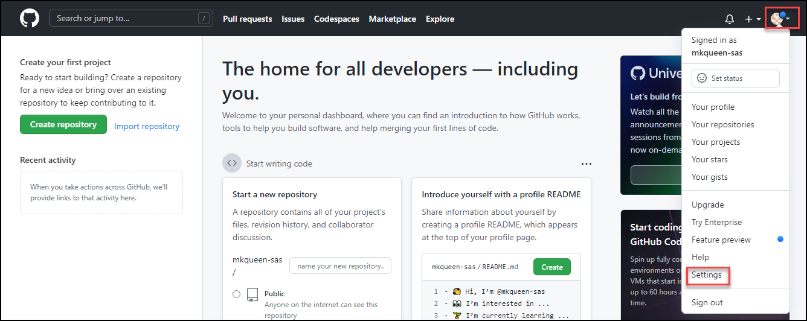

1. Scroll down and select **<> Developer settings**.
1. Select **Personal access tokens &#10132; Tokens(classic)**.

    

1. Select **Generate new token &#10132; Generate new token (classic)**.

    

1. Enter the following information:
   - *Note*:  **My Token for SAS Studio VLE class**
   - *Expiration*: **30 days**
   - *Select scopes*:  **repo**  and   **user**

    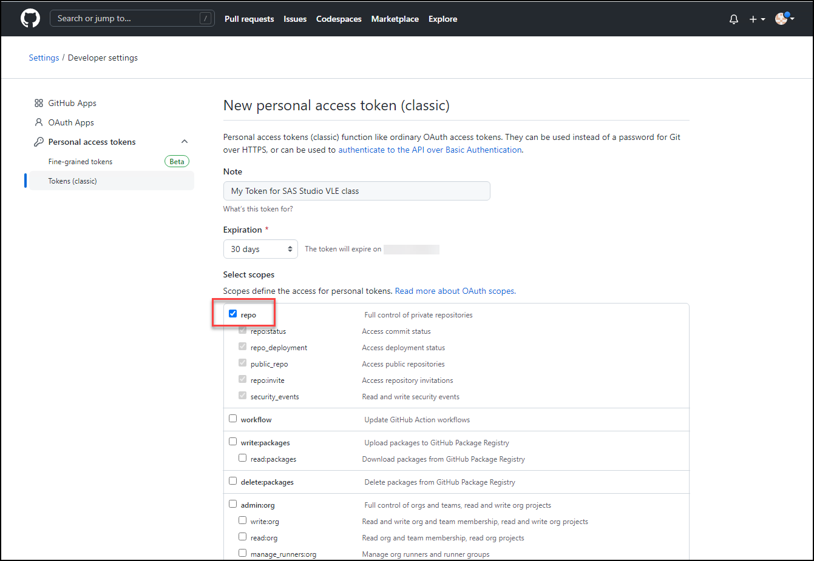
    > &#9998; **user** section is not displayed in this screenshot.

1. Scroll down and click **Generate token**.

    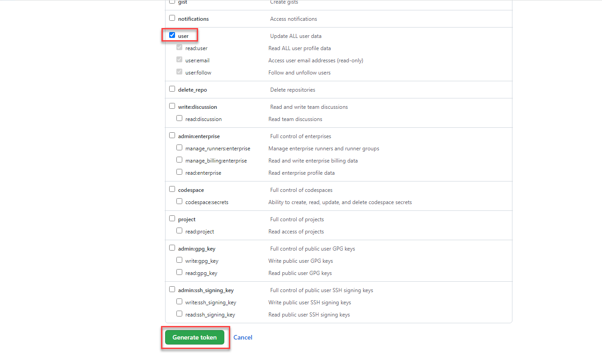

1. Select  to copy the token.
   > &#9888; Make sure to copy your personal access token now. You won’t be able to see it again!

    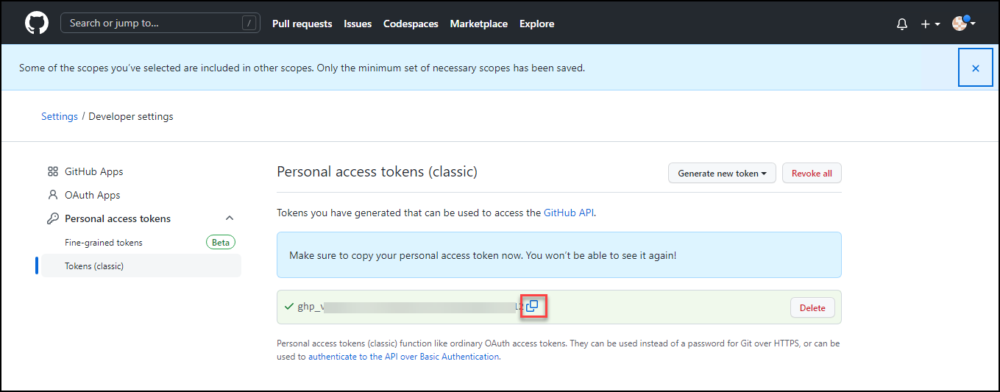

1. Paste the token in *Notepad++* and save it.

      > &#9998; There is an icon on the taskbar for the application.

    

1. Select  to return to your *GitHub dashboard*.

 
 

## Confirm your Email Settings for GitHub
1. Select your account picture **&#10132; Settings**.
1. Select **Emails**.
1. Make note of your **primary email address**.

     > &#9998; You will need this for your Git Profile in SAS Studio.

1.  Ensure that the option to **Block command line pushes that expose my email** is unchecked.

    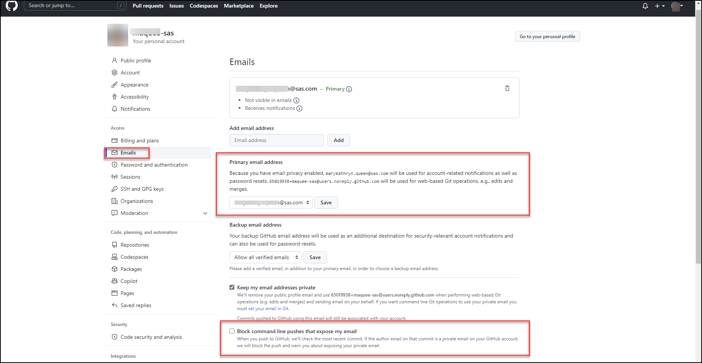

1. Select  to return to your *GitHub dashboard*.

 
 

## Create a Fork of a GitHub Repository

1. Enter **SASInnovate2025/Zephyr-System** in the *Search* area.

    

1. Press **Enter** key to perform the search.
1. Select the hyperlink for the **SASInnovate2025/Zephyr-System** repository.
1. Select **Fork &#10132; Create a new fork**.

     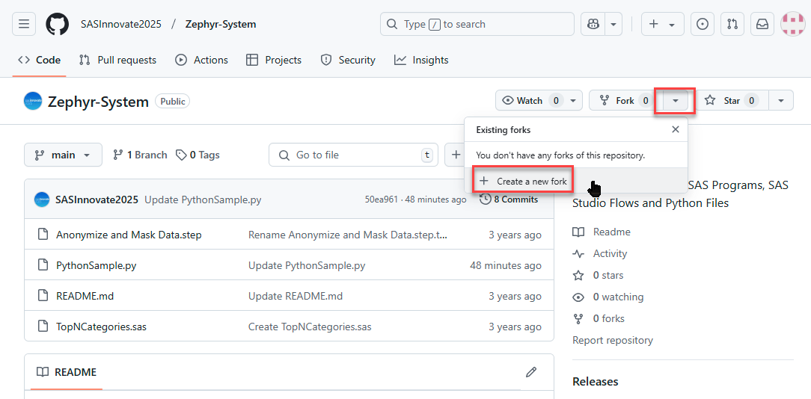

     > &#9998; If you have previously created a fork of this repository, then click the hyperlink for the existing fork.  Select , scroll down and click **Delete this repository**.  Complete the deletion process for the existing fork, then create a new fork.

1. Keep the default settings and click **Create fork**.

     > &#9998; This process can take a few minutes depending upon the size of the repository.

1. Once the creation of the fork is complete, then select **Code**.

     

1. On the *Local* tab, make sure **HTTPS** is selected, and then select  to copy the path to *clone* this fork of the repository.

     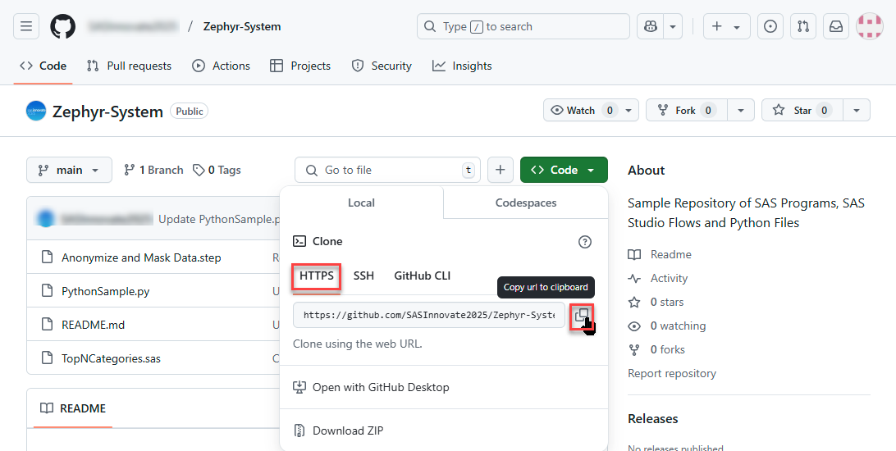

1. Paste the URL in the *Notepad++* file you saved in the token in.

 
 

## Create a Git Profile in SAS Studio
1. Open the **Google Chrome** browser on your Windows RACE Image.
1. Select the **SAS Viya** bookmark.
1. Enter the following:
   - User ID: **Alex**
   - Password: **lnxsas**

1. Click **Sign In**.
1. Select  **&#10132; Develop Code and Flows** to open *SAS Studio*.

    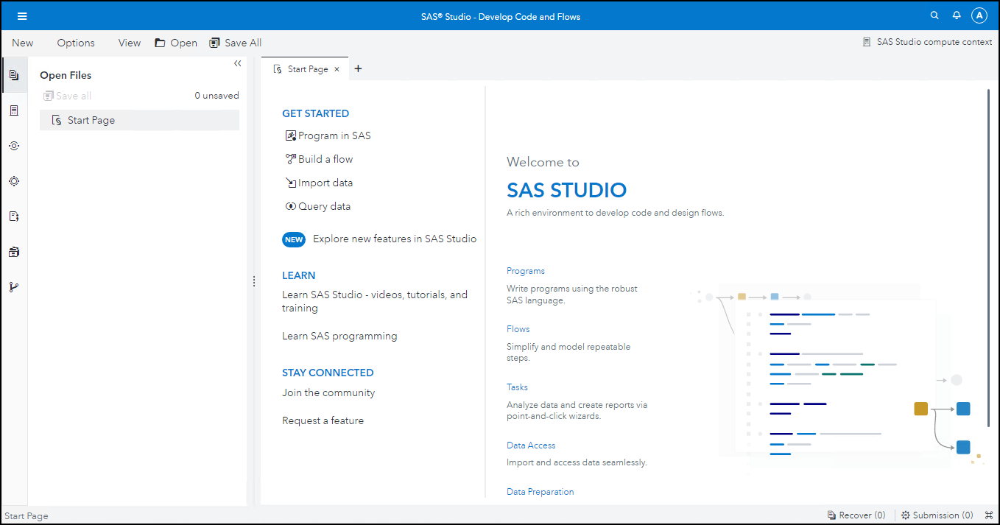

1. Select **Options &#10132; Manage Git Connections**.
1. On the *Manage Git Connections* window, select the **Profiles** tab.
1. Select  to add a profile.

    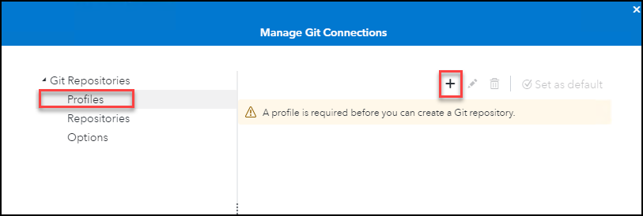

1. Select **HTTPS** tab and enter the following information:
   - Profile name: **MyGitHubProfile**
   - User name: ***&lt;your GitHub user name&gt;***
    - Email: ***&lt;your GitHub primary email address&gt;***
    - Password: ***&lt;paste saved Personal Access Token for GitHub&gt;***

        > &#9998; You created and saved it earlier in this exercise.

    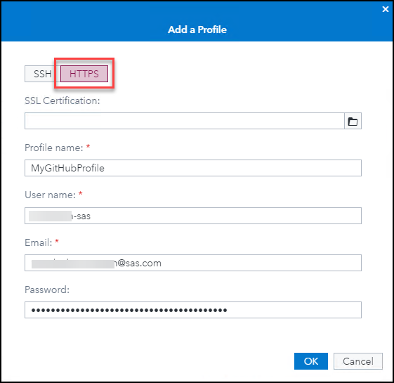

1. Click **OK** to create the profile.

    

1.  Click **Close**.

 
 

## Create a Folder for the Local Copy of the Repository
1. Select  to view the **Explorer** tab in *SAS Studio*.

    

1. Navigate to **SAS Server &#10132; Home &#10132; gelcontent** and select  **&#10132; Folder**.

    > &#9998; The folder for a Git Repository must exist on the SAS Server and be an empty folder.

    

1. Enter the Name **MyGitClone**.

    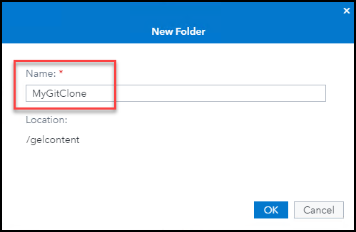

1. Select **OK** to create the folder.
1. Right-click the *MyGitClone* folder and select **Add shortcut**.

    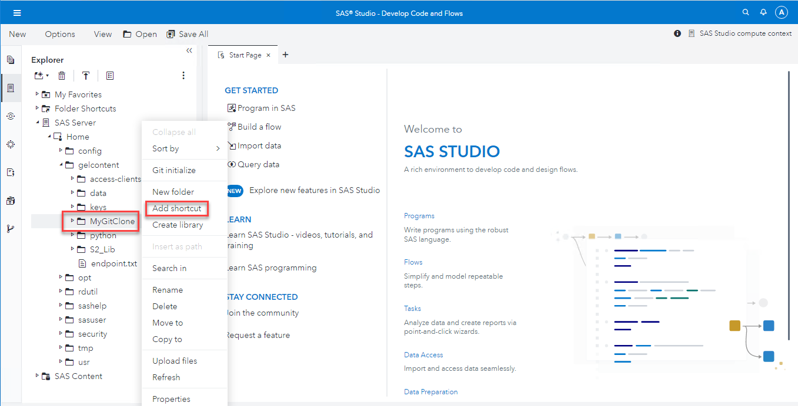

1. Click **OK** to create a shortcut to the folder.
1. Expand the **Folder Shortcuts** section to confirm the shortcut was created.

    

 
 

## Add Repository in SAS Studio
1. Select **Options &#10132; Manage Git Connections**.
1. On the *Manage Git Connections* window, select the **Repositories** tab.
1. Select  **&#10132; Clone a repository** to add a cloned repository.

    

1. Enter the following information:
    - Repository: ***&lt;paste saved URL for cloned (forked) Git repository&gt;***

        > &#9998; You created and saved it earlier in this exercise.

    - Server location: **/gelcontent/MyGitClone**

        > &#9755; Select  to navigate to **SAS Server &#10132; Home &#10132; gelcontent &#10132; MyGitClone** or **Folder Shortcuts &#10132; Shortcut to MyGitClone**.

         > &#9998; This must be an empty folder location.

    - Profile: **MyGitHubProfile**.

    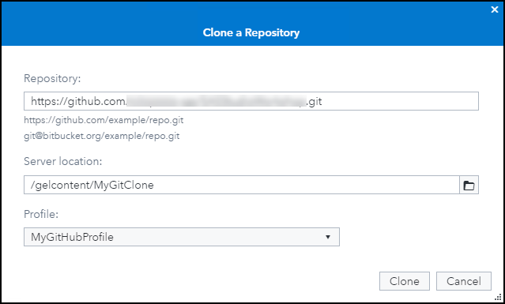

1. Click **Clone** to clone the repository in the location specified.
1. Click **Close**.

 
 

## Review Git Repository
1. Select  to view the **Explorer** tab in *SAS Studio*.
1. Expand **Folder Shortcuts &#10132; Shortcut to MyGITClone** to view the contents of the cloned repository.

     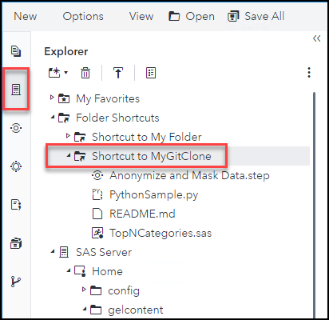

1. Select  to view the **GIT Repositories** tab in *SAS Studio*.
1. Double-click **MyGitClone** to open it in a tab.

    

      > &#9998; This is where you can view the staged/unstaged changes in your local repository and pull/push changes to the external Git repository.

1. Close the *MyGitClone* tab.

 
 

## Exercise Navigation
<!-- startnav -->

<!-- endnav -->

